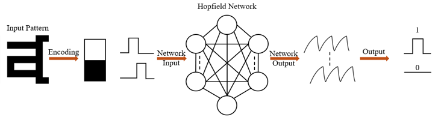
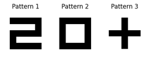
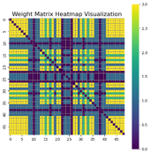
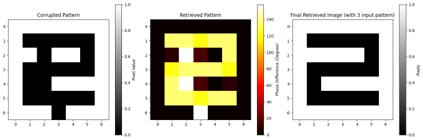
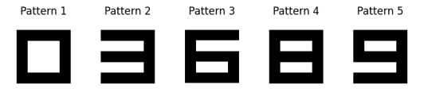
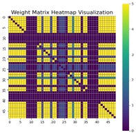
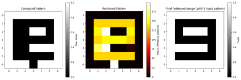

# Memristor-Based Hopfield Network for Pattern Recall

This project implements a Hopfield neural network using memristor-inspired Hebbian learning rules to explore robust pattern recall. The focus lies in understanding how non-volatile memory-like weight persistence can enhance recall stability when inputs are corrupted or incomplete.

This model conceptually mirrors the behavior of **memristive NVM elements** and simulates pattern association under analog constraints.

---

## 🔍 Project Focus

- Designed a **digit pattern recall system** using a Hopfield network
- Implemented **Hebbian learning** to store weight matrices in Python
- Simulated **recall from corrupted and noisy inputs**
- Explored how **pattern stability and overlap** impact recall outcomes

  
*A diagram of the project workflow showing input, processing, and recall steps*

---

## ⚙️ Tools & Technologies

- Python (NumPy, Matplotlib)
- Binary-to-vector encoding of digit patterns
- Iterative update rules mimicking analog memory-based weight retention

---

## 📊 Key Results

- High recall success on uncorrelated stored digit patterns (e.g., 3–5 digits)
- Degradation observed when inputs are more correlated
- Visual confirmation of stable attractor states for clean and semi-noisy patterns

---

## 📷 Visuals (Examples)
  
*Uncorrelated Inputs*

  
*Weight Matrix of Uncorrelated Inputs mapped to resistor values*

  
*Recalled Pattern for Uncorrelated Inputs*

  
*Correlated Inputs*

  
*Weight Matrix of Correlated Inputs mapped to resistor values*

  
*Recalled Pattern for Correlated Inputs*

---

## 🧪 Relevance to NVM Characterization

This project demonstrates key behaviors relevant to non-volatile memory systems:
- **Weight stability** under input fluctuation
- **Analog-inspired update logic**
- **Associative recall robustness** tied to memory persistence

These concepts parallel how embedded memory arrays in microcontroller systems must operate under noisy conditions and degraded signal states—particularly relevant for Smart Power systems in automotive environments.

---

## ⚠️ Disclaimer

This project is based on an academic simulation and does not reflect proprietary work or physical device measurements.
Code for this project is available upon request and can be discussed in interviews. To maintain confidentiality, only core methodology and results are presented here.

---

## 📬 Contact

Created by: [Amirdha Saravanan]  
Email: amirdhas02@gmail.com  
LinkedIn: [linkedin.com/in/amirdha-s](https://www.linkedin.com/in/amirdha-s/)
